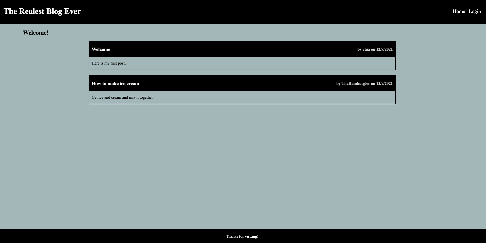

# Tech Blog Site

## Description
This application is a full-functioning blog website where users can create accounts and make blog posts which will be saved to a remote database. In addition, users can edit their posts and comment on posts other users have made.

## Table of Contents
* [Installation](#installation)
* [Usage](#usage)
* [Questions](#questions)

## Installation
To install the application, clone the repo to machine then use 'npm install' to install the necessary packages. MySQL will also need to be on the machine if the application is run locally.

## Usage
Go to the below URL to use the application. To use locally, use 'npm start' to start the local server and go to 'http://localhost:3001' to view.

## Questions
If you have any questions or to see other projects I've done, view my GitHub page here: https://github.com/chaldrich24.

## Link / Screenshot
Here is the link to the live application: https://guarded-spire-04751.herokuapp.com/

